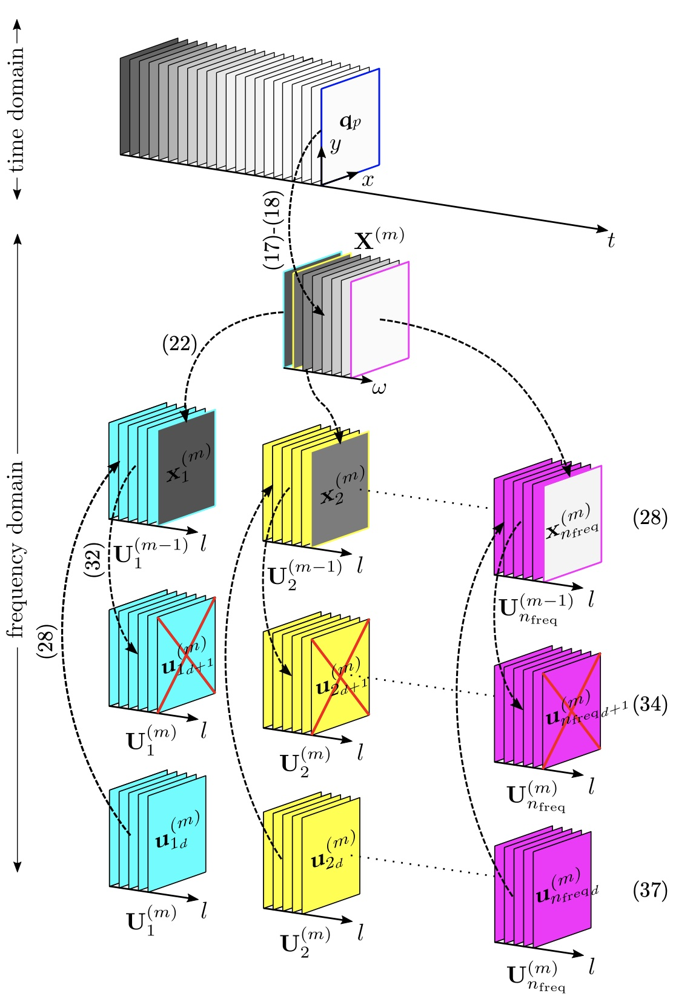

## What is SPOD?

### At glance

**Spectral Proper Orthgonal Decomposition (SPOD)** is a modal analysis
tool [Taira et al 2017](https://doi.org/10.2514/1.J056060), that allows
**extracting spatio-temporal coherent patterns** in **ergodic data**.
Its name, SPOD, was first conied by
[Picard and Delville 2000](https://www.sciencedirect.com/science/article/abs/pii/S0142727X00000217),
and goes back to the original work by
[Lumley 1970](https://www.elsevier.com/books/stochastic-tools-in-turbulence/lumey/978-0-12-395772-6?aaref=https%3A%2F%2Fwww.google.com).
SPOD has been extensively used in the past few years to identify spatio-temporal
coherent patterns in a variety of datasets, mainly in the fluidmechanics
and climate communities. In fluidmechanics it was applied to jets
[Schmidt et al. 2017](https://doi.org/10.1017/jfm.2017.407),
wakes [Araya et al. 2017](https://doi.org/10.1017/jfm.2016.862), and boundary
layers [Tutkun and George 2017](https://aip.scitation.org/doi/10.1063/1.4974746),
among others, while in weather and climate it was applied to ECMWF reanalysis
datasets under the name Spectral Empirical Orthogonal Function, or SEOF,
[Schmidt et al. 2019](https://doi.org/10.1175/MWR-D-18-0337.1),
[Lario et al. 2022](https://www.sciencedirect.com/science/article/pii/S002199912200537X).

The SPOD approach targets **statistically stationary problems** and involves
the **decomposition** of the **cross-spectral density tensor**. This means
that the SPOD leads to a set of spatial modes that oscillate in time at
a single frequency and that optimally capture the variance of an ensemble
of stochastic data [Towne et al. 2018](https://doi.org/10.1017/jfm.2018.283).
Therefore, given a dataset that is statistically stationary, one is able
to capture the optimal spatio-temporal coherent structures that explain
the variance in the dataset.

This can help identifying **relations between multiple variables** or
understanding the **reduced order behavior** of a given phenomenon of
interest. SPOD represents a powerful tool for the **data-driven analysis**
of **nonlinear dynamical systems**. The SPOD approach shares some relationships
with the dynamic mode decomposition (DMD), and the resolvent analysis,
[Towne et al. 2018](https://doi.org/10.1017/jfm.2018.283), that are
also widely used approaches for the data-driven analysis of nonlinear
systems. SPOD can be used for both **experimental** and **simulation data**,
and a general description of its key parameters can be found in
[Schmidt and Colonius 2020](https://doi.org/10.2514/1.J058809).

In PySPOD, we implement two versions, the so-called **batch algorithm**
[Towne 2018](https://doi.org/10.1017/jfm.2018.283),
and the **streaming algorithm**
[Schmidt and Towne 2019](https://doi.org/10.1016/j.cpc.2018.11.009).

Both are based on their Matlab implementation counterpart:
- [batch_spod_matlab](https://github.com/SpectralPOD/spod_matlab)
- [streaming_spod_matlab](https://nl.mathworks.com/matlabcentral/fileexchange/69963-streaming-spectral-proper-orthogonal-decomposition)

### Some math

The SPOD approach seeks to identify a **deterministic (set of) function(s)**
$\phivec(\vm{x},t)$ that best approximates a
**weakly stationary zero-mean stochastic process**
$\vm{q}(\vm{x},t;\, \xi)$, where $\vm{x}$ are the spatial variables,
$t$ is time, and $\xi$ is the parametrization of the probability space.
In mathematical terms, this translates into maximizing

$$
\lambda = \frac{E\{|\langle \vm{q}(\vm{x},t),\phivec(\vm{x},t) \rangle_{\vm{x},t}|^2\}}{\langle \phivec(\vm{x},t),\phivec(\vm{x},t) \rangle_{\vm{x},t}},
$$

where we assume that any realization of $\{\vm{q}(\vm{x},t)\}$ span
a **Hilbert space** $H$ with inner product $\langle \cdot,\cdot \rangle_{\vm{x},t}$
and **expectation operator** $E\{\cdot\}$, here taken to be the **ensemble mean**.
The inner product $\langle \cdot,\cdot \rangle_{\vm{x},t}$ is defined as

$$
\langle \vm{u},\vm{v} \rangle_{\vm{x},t} &=& \int_{-\infty}^{\infty} \int_{S} \vm{u}^*(\vm{x},t) \vm{W} \vm{v}(\vm{x},t) \, \text{d}S_r  \, \text{d}t,
$$

where $\text{d} S_r$ is a generic surface element and $\vm{W}$ is a spatial
weighting matrix. We observe that, if we omit the integration with respect
to time, we readily obtain the associated spatial inner product. Given the
assumption that any realization of $\{\vm{q}(\vm{x},t)\}$ span $H$, and
thanks to Karhunen– Lo{\'e}ve (KL) theorem, we know that there exists a
set of mutually orthogonal deterministic functions that forms a complete
basis in $H$

$$
\vm{q}(\vm{x},t;\,\xi) = \sum_{j=1}^{\infty} a_j\phi_{k}(\vm{x},t;\,\xi).
$$

In the above equation, $\phi_{k}$ are eigenfunctions whose associated
eigenvalues $\lambda_{k}$ arise from the solution of the Fredholm
integral equation

$$
\int_{-\infty}^{\infty} \int_{S} \mathcal{C}(\vm{x},\vm{x}',t,t') \phivec(\vm{x}',t') \, \dd \vm{x}' \, \text{d}t\ = \lambda \phivec(\vm{x},t),
$$

where $\mathcal{C}(\vm{x},\vm{x}',t,t')=E\{\vm{q}(\vm{x},t)\vm{q}^*(\vm{x}',t')\}$
is the two-point space-time correlation tensor.
Due to the stationarity assumption, that means that the correlation function
is invariant under a translation $\tau = t - t'$ in time, i.e.
$\mathcal{C}(\vm{x},\vm{x}',t,t') = \mathcal{C}(\vm{x},\vm{x}',\tau)$,
we can recast the Fredholm integral equation just written in the frequency-space
domain as follows

$$
\int_{S} \mathcal{S}(\vm{x},\vm{x}',f) \psivec(\vm{x}',f) \, \text{d}\vm{x}' = \lambda(f) \vb{\phi}(\vm{x},f),
$$

where $\mathcal{S}(\vm{x},\vm{x}',f)$ is the Fourier transform
of the correlation tensor $\mathcal{C}(\vm{x},\vm{x}',\tau)$,
also referred to as the cross-spectral density tensor

$$
\mathcal{S}(\vm{x},\vm{x}',f) = \int_{-\infty}^{\infty} \mathcal{C}(\vm{x},\vm{x}',\tau) e^{\mathrm{i}2\pi f \tau} \text{d}\tau
$$

At each frequency, the frequency-space eigenvalue problem (\ref{eq:seof})
yields a countably infinite number of _SEOF modes_ $\vb{\phi}(\vm{x},f)$
as eigenvectors (principal components) of the cross-spectral density tensor,
and the same number of corresponding \emph{modal energies} $\lambda_i(f)$.
For any given frequency $f$, the SEOF modes have the following useful
(not necessarily mutually exclusive) properties:

- time-harmonic with a single frequency $f$,
- space-time coherent and orthogonal under equation~\eqref{eq:innerprod_spacetime}:
$\langle \psivec_i(\vm{x}',f)e^{\mathrm{i}2\pi f t},\psivec_j(\vm{x}',f)e^{\mathrm{i}2\pi f t} \rangle_{\vm{x},t} = \delta_{ij}$,
- optimally represent the space-time flow statistics, and
- optimally ranked in terms of variance \newline $\lambda_i(f)$: $\lambda_1(f)\geq\lambda_2(f)\geq\lambda_3(f)\geq\dots\geq0$,

|{:width="30%"}|{:width="30%"}
:-------------------------:|:-------------------------:
|Batch algorithm. Figure from [Schmidt and Towne 2019](https://doi.org/10.1016/j.cpc.2018.11.009).|Streaming algorithm. Figure from [Schmidt and Towne 2019](https://doi.org/10.1016/j.cpc.2018.11.009).|

#### The batch algorithm

#### The streaming algorithm

## What do we implement?

**PySPOD** is a Python package that implements the so-called
**Spectral Proper Orthgonal Decomposition**.

We implement two versions of SPOD, both available as **parallel (distributed)**
via [mpi4py](https://github.com/mpi4py/mpi4py):

  - **spod_standard**: this is the **batch** algorithm as described

  - **spod_streaming**: that is the **streaming** algorithm presented
    in [Schmidt and Towne 2019](https://doi.org/10.1016/j.cpc.2018.11.009).

We additionally implement the calculation of time coefficients
and the reconstruction of the solution, given a set of modes
$\phi$ and coefficients _a_, as explained in e.g.,
[Lario et al. 2022](https://www.sciencedirect.com/science/article/pii/S002199912200537X).

To see how to use the **PySPOD** package, you can look at the
[**Tutorials**](./tutorials).

## What data can we apply SPOD to?

SPOD can be applied to wide-sense stationary data, that is ergodic
processes. Examples of these arise in different fields, including
fluidmechanics, and weather and climate, among others. An example
of ergodic data can be found in [**Tutorial 1**](./tutorials/tutorial1).

[Go to the Home Page]({{ '/' | absolute_url }})
